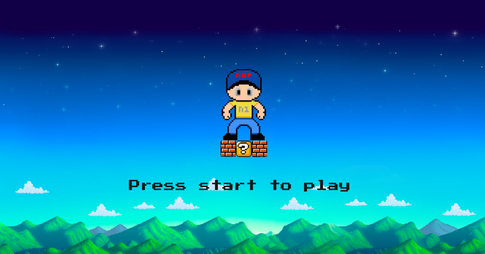

# Nofy Frames Project

## Number One Fan (NoF)



## Eth Global - Frameworks - Hackathon

## Introduction

Nofy, in its farcaster frames version, represents the Number One Fan community as the project's main ambassador. Its secret lives in the nostalgia generated by pop culture and cosplay. Nofy is the number one fan!
 
If you're looking to find activity and fun to farcaster, Nofy is the perfect choice. With an exciting gaming system and a collection of 120 unique characters, Nofy offers an unparalleled experience for users.
 
You'll be able to compete with your friends in the global leaderboard to prove who the real number one fan is.
 
Don't miss the opportunity to be part of this community. Play Nofy and discover the thrill of collecting, competing, and enjoying pop culture!
 
If you've enjoyed playing with Nofy, we invite you to leave a review and share your opinion. We'd love to hear your feedback and continue improving to provide you with the best possible experience!

## How it's made?

On this occasion, and as is customary for this team, we have implemented development using EVM-compatible technologies, starting with Solidity, Foundry on Base. Our interface is created in Next.js with FRAMES.JS. All on-chain data is consumed with The Graph. Our APis are deployed
on Google Cloud and assets on Pinata.

## Contract address


## Build With

- [nextJs Framework](https://nextjs.org/)

## Live Demo

- [Nofy Live Demo](https://farcaster.nof.town)

# Collaborators

[P4Troy](https://github.com/mpefaur) - [Tomas di Mauro](https://github.com/TomasDmArg) - [Hernan Castro](https://github.com/Magehernan)

## Run App

```sh
npm run dev / yarn dev
```

## Use App

```sh
Open browser in http://localhost:3000/
```

## Commit changes

The application uses a linter for commit messages, requiring them to be specified in the following format:

```
- [type] message
- [type] :icono: message
```

Example:

```
- commit -m [chore] add commitlinter
- commit -m [chore] :sparkles: add commitlinter (to commit with an icon, you can use [gitmoji](https://gitmoji.dev/))
```

The allowed standard types are:

```
- feat: A new feature for the user.
- fix: Fixes a bug that affects the user.
- perf: Changes that improve site performance.
- build: Changes in the build system, deployment tasks, or installation.
- ci: Changes in continuous integration.
- docs: Changes in documentation.
- refactor: Code refactoring such as variable or function name changes.
- style: Changes in formatting, tabs, spaces, or semicolons, etc.; do not affect the user.
- test: Adds tests or refactors an existing one.
- chore: Other changes that don't modify src or test files.
- revert: Reverts a previous commit.
```

Failing to comply with these standards will cause the pre-commit to fail. To remove the last commit (without losing changes), run:

```sh
git reset --soft HEAD~1
```

For more information, refer to: [commitlint](https://commitlint.js.org/#/).


